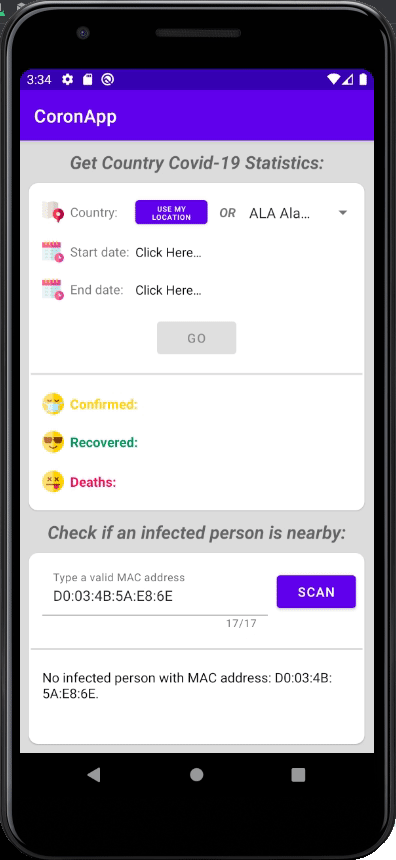

# CoronApp (SuperCom)

Small modern android Covid-19 app based <b>MVVM</b> architecture where you are able to generate Covid-19 statistics results based on the remote API and to search BLE MAC addresses in your area
used libraries/features:
* <b>Corutines</b> - Asynchronous programming
* <b>Hilt</b> - Dependency Injection
* <b>Retrofit</b> - Network
* <b>BLE</b> - Bluetooth
* <b>Location</b> - Fused Location

